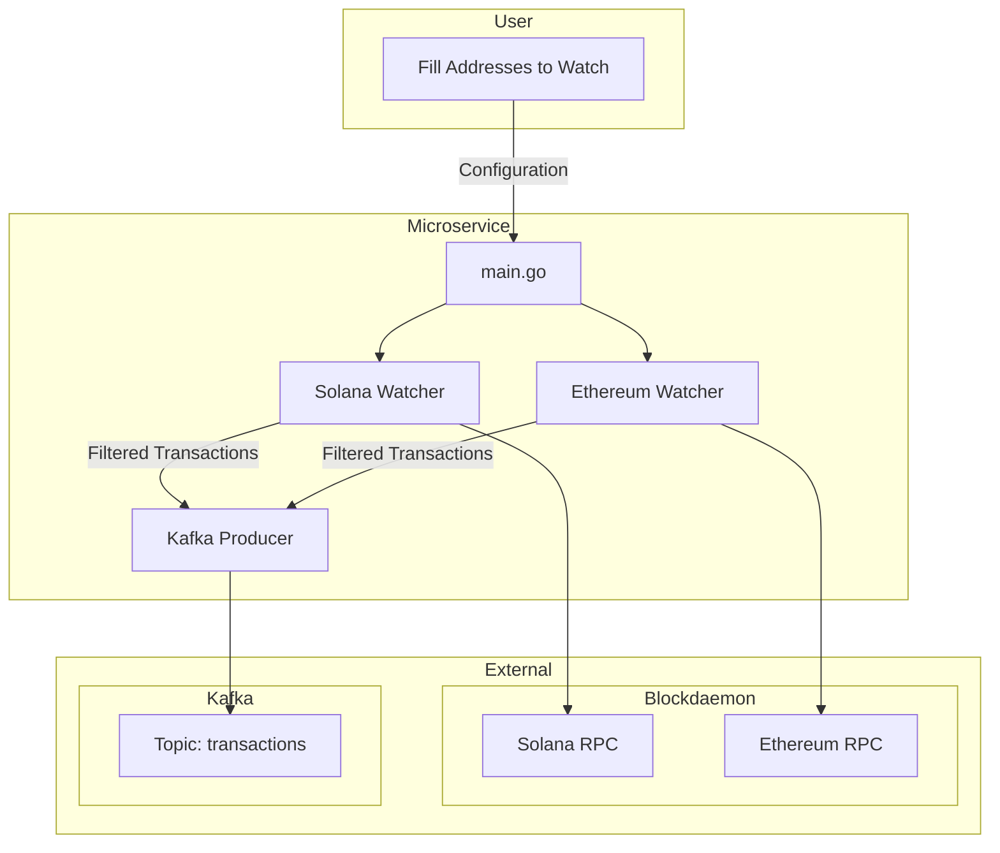

# Backend Interview Crypto

## Setup Instructions

### 1. Configure Environment Variables
Copy the example file and fill it

```bash
cp .env.example .env
```

### 2. Start Kafka
Start with docker compose

```bash
docker-compose up -d
```

### 3. Run the service 
Send captured transactions to Kafka

```bash
go run cmd/main.go
```

## Check transactions

### On kafka:

```bash
docker-compose exec kafka kafka-console-consumer.sh --bootstrap-server localhost:9092 --topic transactions --from-beginning
```

### On explorers:
[Ethereum](https://etherscan.io/), [Solana](https://solana.fm/?cluster=mainnet-alpha)

## Improvements
- Add Bitcoin
- Add retries on failed requests 
- Validate addresses
- Use a paid RPC plan to avoid rate limiting (especially on Solana)
- Implement graceful shutdown using context
- Persist the current block in a database to resume processing after a restart

## Bonus

### 🧩 What would be the production architecture ?

Ideally, the system should consist of two components for each blockchain.

1. **Real-time block monitoring**  
   - Use WebSocket connections (if available) to listen for new blocks as they arrive. 
   - This helps send filtered transactions to Kafka with minimal delay.

2. **Gap filling & reorg handling**  
   - Run a separate goroutine that checks for missing blocks (e.g., during downtime or network hiccups). Blocks already processed should be put in a database.
   - Verify past transactions within a reorg-safe window (different for each blockchain) to ensure consistency.


## Diagram
